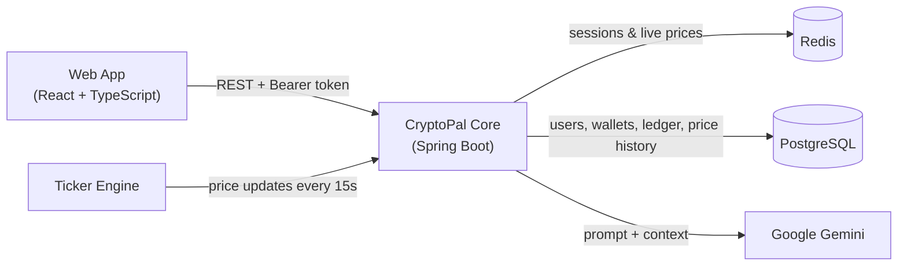

# CryptoPal

Real-time crypto trading & AI-insights platform. CryptoPal streams live market
prices, lets users execute simulated buy/sell trades against a starting balance,
tracks their portfolio, and answers natural-language questions about their
account and the market through a Google Gemini assistant.

## Architecture



The **Core** is a single Spring Boot modular monolith. Each capability lives in
its own package:

| Module | Responsibility |
|---|---|
| `auth` | Registration, login, BCrypt passwords, Redis session tokens |
| `market` | Ticker engine, 15s price scheduler, Redis cache, price history |
| `trading` | Transactional buy/sell, holdings, portfolio valuation |
| `ai` | Gemini client, context enrichment, prompt orchestration, resilient fallback |

- **PostgreSQL** is the single source of truth for all persistent financial data.
- **Redis** holds only volatile data: session tokens and the latest prices.
- **External data** comes from a local **Ticker Engine** behind a Java interface
  (`PriceDataProvider`), so a live API can be swapped in without touching business logic.

## Tech stack

- **Backend:** Java 21, Spring Boot 3.3, Spring Security, Spring Data JPA, Spring Data Redis, Resilience4j, springdoc/OpenAPI
- **Frontend:** React 19, TypeScript, Vite, react-markdown
- **Data:** PostgreSQL 16, Redis 7
- **AI:** Google Gemini
- **Tests:** JUnit 5, Mockito, Testcontainers (backend), Selenium (end-to-end UI)
- **Infra:** Docker Compose, multi-stage Docker builds, GitHub Actions CI

## Prerequisites

- Docker Desktop
- JDK 21 and Maven 3.9+ (only for the local dev workflow)
- Node.js 20+ (only for the local dev workflow)
- A Google Gemini API key — create one at https://aistudio.google.com/app/apikey

## Configuration

Copy the example env file and fill in your values:

```bash
cp .env.example .env
```

| Variable | Description | Default |
|---|---|---|
| `POSTGRES_USER` / `POSTGRES_PASSWORD` / `POSTGRES_DB` | PostgreSQL credentials | `cryptopal` / — / `cryptopal` |
| `POSTGRES_PORT` | Host port for PostgreSQL | `5432` |
| `REDIS_PORT` | Host port for Redis | `6379` |
| `DATA_PROVIDER_PROFILE` | Price source (`ticker`) | `ticker` |
| `GEMINI_API_KEY` | Google Gemini API key | — |
| `GEMINI_MODEL` | Gemini model id | `gemini-3.5-flash` |

`.env` is gitignored and must never be committed. No credentials or API keys are
hardcoded anywhere; the application reads all configuration from the environment.

## Running

### Option A — Full stack in Docker (one command)

Builds and starts everything: PostgreSQL, Redis, backend, and frontend.

```bash
docker compose --profile full up -d --build
```

- Web app: http://localhost:5173
- API + Swagger: http://localhost:8080/swagger-ui.html

Stop it with `docker compose --profile full down`.

### Option B — Local development

Start only the infrastructure with Docker, run the apps on your machine for hot reload.

```bash
# 1. PostgreSQL + Redis (schema is created automatically on first run)
docker compose up -d

# 2. Backend (loads .env, requires JDK 21)
cd backend
mvn -DskipTests package
java -jar target/cryptopal-core-0.0.1-SNAPSHOT.jar

# 3. Frontend (in a second terminal)
cd frontend
npm install
npm run dev
```

The database schema is defined in `infra/db/init/01_schema.sql` and executes
automatically the first time the PostgreSQL container initializes.

## API documentation

Interactive Swagger UI is available at http://localhost:8080/swagger-ui.html.
Use `/auth/register` then `/auth/login`, click **Authorize**, paste the returned
token, and every protected endpoint becomes testable from the browser.

## Testing

```bash
# Backend unit + integration tests (Testcontainers needs Docker)
cd backend && mvn test

# End-to-end UI tests (requires the app running at http://localhost:5173 and Chrome)
cd e2e && mvn test
```

## Project structure

```
cryptopal/
├── backend/            Spring Boot Core (modular monolith)
├── frontend/           React + TypeScript SPA
├── e2e/                Selenium end-to-end tests
├── infra/db/init/      PostgreSQL DDL scripts
└── docker-compose.yml  PostgreSQL + Redis (+ full-stack profile)
```
